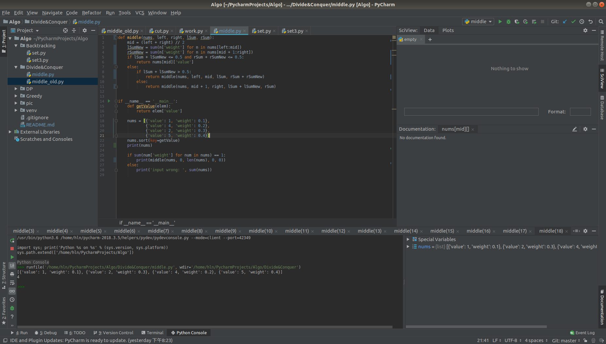
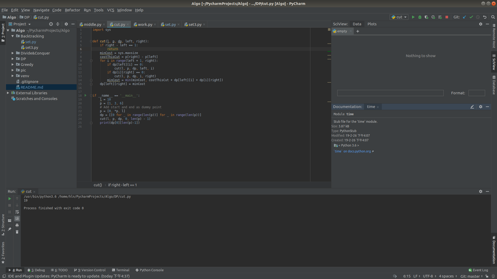
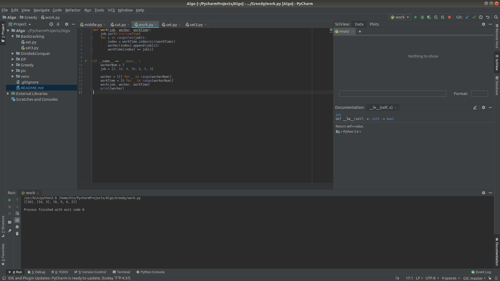
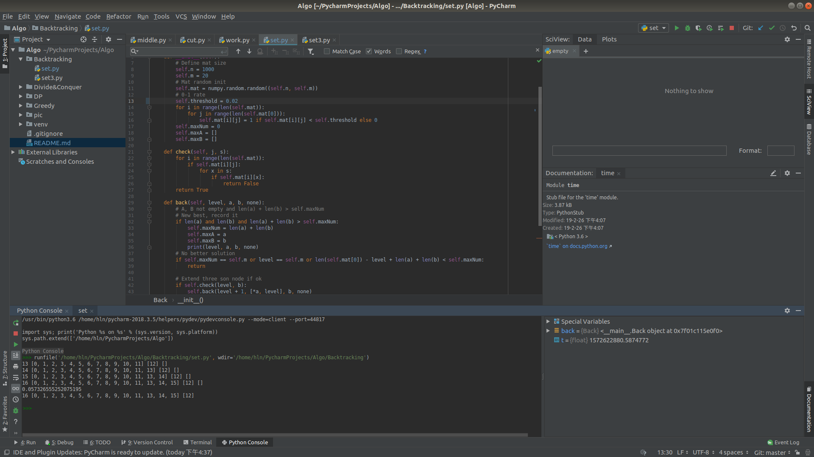
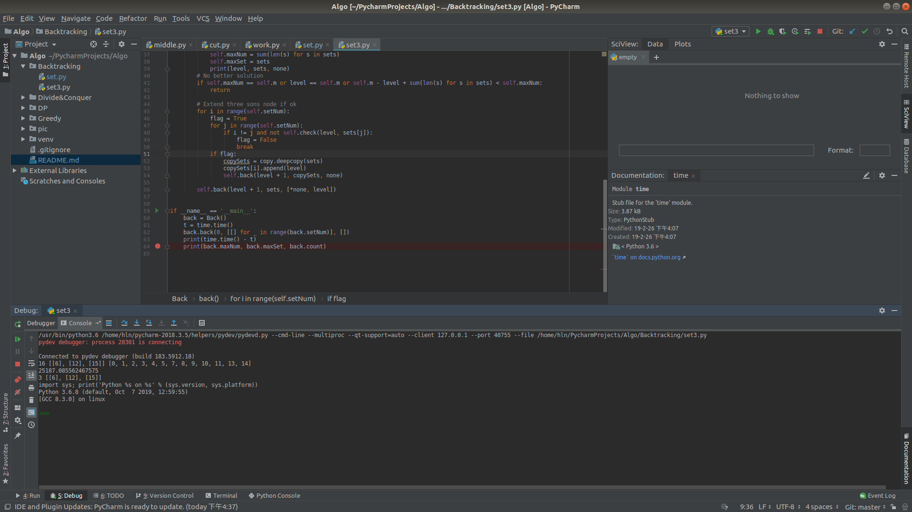

# Algo


## 分治与递归

### 问题描述

设有n个互不相同的元素`x1,x2,…,xn`，每个元素`xi`带有一个权值`wi`，且所有元素权值之和为`1`。若元素`xk`满足比`xk`小的所有元素权值之和小于等于`1/2`且比`xk`大的所有元素权值之和小于等于`1/2`，则称元素`xk`为`x1,x2,…,xn`的带权中位数。请编写一个算法，能够在最坏情况下用`O(n)`时间找出`n`个元素的带权中位数。
### 问题分析

题目要求在`O(n)`的时间内从n个元素中选择一个符合要求的元素，故可考虑使用线性时间选择算法。

### 算法设计

- 首先取剩余元素中的第一个做为分界点，将剩余元素按照和分界点的大小分为两组。
- 若此次的大数组和之前的大数组所有元素之和小于等于`1/2`，且此次的小数组和之前的小数组所有元素之和小于等于`1/2`，那么满足题目条件，上一步骤中选择的分界点就是题目所求的带权中位数。
- 若不满足，假设是此次的大数组和之前的大数组所有元素之和大于`1/2`。那么此次的小数组加入之前的小数组，之前的大数组不变，并将此次的大数组作为剩余元素重复上述过程。若小数组不满足条件则同理。

### 算法实现

```python
def middle(nums, sumLeft, sumRight):
    leftList = []
    rightList = []
    lSum = 0
    rSum = 0

    # Using nums[0] to divide nums
    x = nums[0]
    for i in range(1, len(nums)):
        if nums[i] < x:
            leftList.append(nums[i])
            lSum += nums[i]
        else:
            rightList.append(nums[i])
            rSum += nums[i]

    if sumLeft + lSum <= 0.5 and sumRight + rSum <= 0.5:
        # If both smaller than 0.5, nums[0] is what we find
        return nums[0]
    else:
        # If not, redo with the big side
        if sumLeft + lSum > 0.5:
            return middle(leftList, sumLeft, sumRight + rSum + nums[0])
        else:
            return middle(rightList, sumLeft + lSum + nums[0], sumRight)


if __name__ == '__main__':
    nums = [0.1, 0.2, 0.3, 0.4]
    if sum(nums) == 1:
        print(middle(nums, 0, 0))
    else:
        print('input wrong: ', sum(nums))

```

### 运行结果




## 动态规划

### 问题描述

设有一个长度为`L`的钢条，在钢条上标有`n`个位置点`(p1,p2,…,pn)`。现在需要按钢条上标注的位置将钢条切割为`n+1`段，假定每次切割所需要的代价与所切割的钢条长度成正比。请编写一个算法，能够确定一个切割方案，使切割的总代价最小。

### 问题分析

题目已经要求用动态规划求解，故考虑此题的子问题结构。钢条可以在标注位置按照任意次序切割，故需要记录从切割点`pi`到切割点`pj`的最小代价，所以应该使用一个二维的`dp`矩阵记录每一个子问题的最优解，其中`dp[i][j]`表示切割从`i`到`j`段钢条的最小代价。

### 算法设计

- 为了便于表示含头或者含尾子段的最优切割方案，在`p`列表的最前和最后加入`p=0`和`p=l`的`dummy`切割点。
- `cut(i,j)`函数计算切割`i,j`子段的最小代价。
  - minCost = min(cut(i,k) + cut(k + 1, j) + lenth(i, j))	i < k <j
  - 如果`dp[i][j]`存在，则直接使用`dp[i][j]`作为`cut(i, j)`代入计算；若不存在则使用`cut(i, j)`同时存入`dp[i][j]`中。

### 算法实现

```python
import sys


def cut(l, p, dp, left, right):
    if right - left == 1:
        return
    minCost = sys.maxsize
    costThisCut = p[right] - p[left]
    for i in range(left + 1, right):
        if dp[left][i] == 0:
            cut(l, p, dp, left, i)
        if dp[i][right] == 0:
            cut(l, p, dp, i, right)
        minCost = min(minCost, costThisCut + dp[left][i] + dp[i][right])
    dp[left][right] = minCost


if __name__ == '__main__':
    l = 10
    p = [1, 3, 6]
    # Add start and end as dummy point
    p = [0, *p, l]
    dp = [[0 for _ in range(len(p))] for _ in range(len(p))]
    cut(l, p, dp, 0, len(p) - 1)
    print(dp[0][len(p)-1])

```

### 运行结果

```python
# Input:
# l = 10
# p = [1, 3, 6]
```

输入：钢条总长10，共有三个切割点分别为1， 3， 6。

```python
# Output:
# 19
```

输出：切割的最小代价为19




## 贪心法

### 问题描述

有`n`个作业和`m`台相同设备，每个作业`i`可选择一台设备进行加工，加工时间为`ti`。每台机器一次只能加工一个作业。编写算法，实现对作业的调度，使得`n`个作业的等待时间和最小。

### 问题分析

这个问题是一个NP完全问题，目前还没有有效的解法。可以用贪心选择策略得到较优解。

### 算法设计

- 将作业按工加工时间降序排列。
- 依次将作业分配给总加工时间最短的设备。

### 算法实现

```python
def work(job, worker, workTime):
    job.sort(reverse=True)
    for i in range(len(job)):
        index = workTime.index(min(workTime))
        worker[index].append(job[i])
        workTime[index] += job[i]


if __name__ == '__main__':
    workerNum = 3
    job = [2, 14, 4, 16, 6, 5, 3]

    worker = [[] for _ in range(workerNum)]
    workTime = [0 for _ in range(workerNum)]
    work(job, worker, workTime)
    print(worker)

```

### 运行结果

```python
# Input:
# workerNum = 3
# job = [2, 14, 4, 16, 6, 5, 3]
```

输入：共有3台设备，需要加工的作业加工时长为[2, 14, 4, 16, 6, 5, 3]。

```python
# Output:
# [[16], [14, 3], [6, 5, 4, 2]]
```

输出：每台设备加工的工作时间长度。（也可以将程序的第5行改为append(i)，则输出为每台设备加工的工作序号）。




## 回溯/分支界限法

### 问题描述

 给定1个`1000`行×`20`列的`0-1`矩阵，对于该矩阵的任意1列，其中值为1的元素的数量不超过`10%`。设有两个非空集合`A`和`B`，每个集合由矩阵的若干列组成。集合`A`和`B`互斥是指对于矩阵的任意一行，同时满足下列2个条件：1）若`A`中有一个或多个元素在这一行上的值是1，则`B`中的元素在这一行全部是0；2）若`B`中有一个或多个元素在这一行上的值是1，则`A`中的元素在这一行全部是0。请你设计一个算法，找出一对互斥集合`A`和`B`，使得`A`和`B`包含的列的总数最大。

### 问题分析

题目需要解决的两个问题：

- 判断将要加入的列是否与现有集合满足互斥条件的
- 设计一个搜索算法，搜索AB集合所有可能情况。

### 算法设计

这个问题相对复杂，故使用面向对象的方法设计。使用回溯法深度优先搜索，配合剪枝策略减小解空间需要搜索的范围。

- 定义一个`Back`对象，对象初始化是随机生产一个`1000*20`的矩阵，`0-1`比例可调。
- `Back.check()`函数用于检查当前的第`j`列是否能加入集合`S`当中。按照`1000`行逐行比较即可。
- `Back.back()`函数输入当前搜索树层数`level`，集合`A`，`B`和为选入`AB`的列的集合`none`。
  - 判断当前是否是更优解：若`A`， `B`非空且`len(A) + len(B) > Back.maxNum`，记录新的更优解。
  - 判断剪枝条件：如果以及找到全局可能存在的最优解（所有列都以及加入`A`，`B`），或者到达叶子节点，或者当前节点的子树不可能有更优解。处死该节点和子树。
  - 若满足条件，该节点可以拓展：判断新加入的列是否与`A`， `B`集合互斥，并搜索下一层。

### 算法实现

```python
import numpy
import time


class Back:
    def __init__(self):
        # Define mat size
        self.n = 1000
        self.m = 20
        # Mat random init
        self.mat = numpy.random.random((self.n, self.m))
        # 0-1 rate
        self.threshold = 0.1
        for i in range(len(self.mat)):
            for j in range(len(self.mat[0])):
                self.mat[i][j] = 1 if self.mat[i][j] < self.threshold else 0
        self.maxNum = 0
        self.maxA = []
        self.maxB = []

    def check(self, j, s):
        for i in range(len(self.mat)):
            if self.mat[i][j]:
                for x in s:
                    if self.mat[i][x]:
                        return False
        return True

    def back(self, level, a, b, none):
        # A, B not empty and len(a) + len(b) > self.maxNum
        # New best, record it
        if len(a) and len(b) and len(a) + len(b) > self.maxNum:
            self.maxNum = len(a) + len(b)
            self.maxA = a
            self.maxB = b
            print(level, a, b, none)
        # No better solution
        if self.maxNum == self.m or level == self.m or len(self.mat[0]) - level + len(a) + len(b) < self.maxNum:
            return

        # Extend three son node if ok
        if self.check(level, b):
            self.back(level + 1, [*a, level], b, none)
        if self.check(level, a):
            self.back(level + 1, a, [*b, level], none)
        if len(self.mat[0]) - level + len(a) + len(b) - 1 < self.maxNum:
            self.back(level + 1, a, b, [*none, level])


if __name__ == '__main__':
    back = Back()
    t = time.time()
    back.back(0, [], [], [])
    print(time.time() - t)
    print(back.maxNum, back.maxA, back.maxB)

```

### 运行结果

```python
# Input:
None
```

输入：无

```python
# Output:
# 16 [0， 1， ..., 15], [12]
```

输出：`A`, `B`集合列数和，以及`A`, `B`所分别含有的列。




## 选做题

### 问题描述

 给定1个`1000`行×`20`列的`0-1`矩阵，对于该矩阵的任意1列，其中值为1的元素的数量不超过`10%`。设有两个非空集合`A`和`B`，每个集合由矩阵的若干列组成。集合`A`和`B`互斥是指对于矩阵的任意一行，同时满足下列2个条件：1）若`A`中有一个或多个元素在这一行上的值是1，则`B`中的元素在这一行全部是0；2）若`B`中有一个或多个元素在这一行上的值是1，则`A`中的元素在这一行全部是0。请你设计一个算法， 找出集合`A`、`B`和`C`，满足：1）`A`、`B`、`C`两两互斥，且2）`A`、`B`和`C`包含的列的总数最大。

### 问题分析

选做题和回溯法的题目用了完全相同的思路。只不过为了方便拓展，将代码进行了一定重构，使集合数量可以自定义设置。在三个集合`ABC`的情况下，之前的三叉树搜索变为了四叉树搜索，搜索量激增。

### 算法实现

```python
import numpy
import time
import copy


class Back:
    def __init__(self):
        self.count = 0
        # Define mat size
        self.n = 1000
        self.m = 20
        self.setNum = 3
        # Mat random init
        self.mat = numpy.random.random((self.n, self.m))
        self.threshold = 0.05
        # 0-1 rate
        for i in range(len(self.mat)):
            for j in range(len(self.mat[0])):
                self.mat[i][j] = 1 if self.mat[i][j] < self.threshold else 0
        self.maxNum = 0
        self.maxSet = [[] for _ in range(self.setNum)]

    def check(self, j, s):
        for i in range(len(self.mat)):
            if self.mat[i][j]:
                for x in s:
                    if self.mat[i][x]:
                        return False
        return True

    def back(self, level, sets, none):
        # print(level, sets, none)
        self.count += 1
        # A, B not empty and len(a) + len(b) > self.maxNum
        # New best, record it
        if len(sets) and all(len(s) for s in sets) and sum(len(s) for s in sets) > self.maxNum:
            self.maxNum = sum(len(s) for s in sets)
            self.maxSet = sets
            print(level, sets, none)
        # No better solution
        if self.maxNum == self.m or level == self.m or self.m - level + sum(len(s) for s in sets) < self.maxNum:
            return
        
        # Extend three sons node if ok
        for i in range(self.setNum):
            flag = True
            for j in range(self.setNum):
                if i != j and not self.check(level, sets[j]):
                    flag = False
                    break
            if flag:
                copySets = copy.deepcopy(sets)
                copySets[i].append(level)
                self.back(level + 1, copySets, none)

        self.back(level + 1, sets, [*none, level])


if __name__ == '__main__':
    back = Back()
    t = time.time()
    back.back(0, [[] for _ in range(back.setNum)], [])
    print(time.time() - t)
    print(back.maxNum, back.maxSet, back.count)

```

### 运行结果

